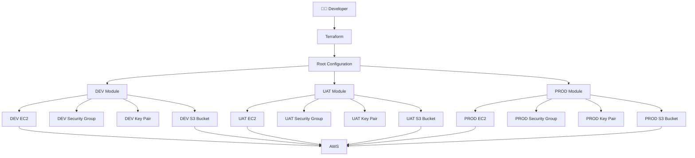
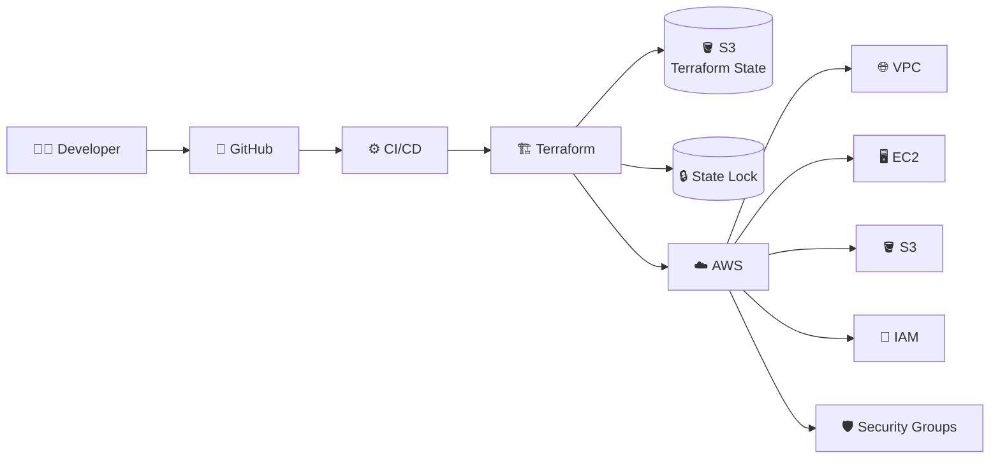

# 🚀 Terraform AWS Multi-Environment Infrastructure

<p align="center">


</p>

<p align="center">
  <b>🌩️ Provisioning scalable AWS infrastructure using reusable Terraform modules</b>
</p>

<p align="center">
  <i>DEV • UAT • PROD | EC2 • S3 • VPC • Security Groups • SSH • Terraform Modules</i>
</p>

---

## 📌 Overview

This project demonstrates how to provision and manage **multiple AWS environments using Terraform modules**.

Instead of writing separate infrastructure code for DEV, UAT, and PROD, this project uses a **reusable Terraform module** and passes environment-specific configuration from the root module.

### 🎯 Environments

| Environment |    EC2 Type | Instance Count | Root Storage | Volume |
| ----------- | ----------: | -------------: | -----------: | ------ |
| 🟢 DEV      |  `t2.micro` |              1 |        20 GB | `gp2`  |
| 🟡 UAT      |  `t2.small` |              1 |        20 GB | `gp2`  |
| 🔴 PROD     | `t2.medium` |              1 |        20 GB | `gp2`  |

Each environment creates its own:

* 🖥️ EC2 instance
* 🔐 SSH Key Pair
* 🛡️ Security Group
* 🪣 S3 bucket

---

# 🏗️ Architecture

The project follows a modular Infrastructure-as-Code architecture.



> 💡 **Key idea:** The infrastructure logic is written once inside `infra-app/` and reused for DEV, UAT, and PROD.

---

# 🔄 Terraform Workflow

The infrastructure follows the standard Terraform lifecycle:

```text
             ┌──────────────┐
             │ Terraform    │
             │ Configuration│
             └──────┬───────┘
                    │
                    ▼
             ┌──────────────┐
             │ terraform    │
             │    init      │
             └──────┬───────┘
                    │
                    ▼
             ┌──────────────┐
             │ terraform    │
             │    plan      │
             └──────┬───────┘
                    │
                    ▼
             ┌──────────────┐
             │ terraform    │
             │    apply     │
             └──────┬───────┘
                    │
                    ▼
          ┌─────────────────────┐
          │      AWS Cloud      │
          ├─────────────────────┤
          │ EC2                 │
          │ S3                  │
          │ Security Groups     │
          │ Key Pairs           │
          │ Default VPC         │
          └─────────────────────┘
```

---

# 📁 Project Structure

```text
terraform-aws-infrastructure/
│
├── 📄 main.tf
├── 📄 provider.tf
├── 📄 terraform.tf
├── 📄 .gitignore
│
├── 📂 infra-app/
│   │
│   ├── 📄 ec2.tf
│   ├── 📄 s3.tf
│   └── 📄 variables.tf
│
├── 🔑 terra-key-ec2.pub
│
└── 📄 README.md
```

### 🧩 Root Module

The root configuration controls the different environments:

```text
main.tf
   │
   ├── module "dev-infra"
   │
   ├── module "uat-infra"
   │
   └── module "prod-infra"
```

### ♻️ Reusable Module

```text
infra-app/
   │
   ├── ec2.tf
   ├── s3.tf
   └── variables.tf
```

This allows the same infrastructure definition to be reused with different parameters.

---

# 🧱 Infrastructure Components

## 🖥️ Amazon EC2

Each environment creates EC2 instances using configurable parameters.

```hcl
resource "aws_instance" "my_ec2" {
  count         = var.aws_instance_count
  ami           = var.ec2_ami_id
  instance_type = var.aws_instance_type

  key_name        = aws_key_pair.my_key_pair.key_name
  security_groups = [aws_security_group.my_security_group.name]

  root_block_device {
    volume_size = var.aws_root_storage_size
    volume_type = var.volume_type
  }
}
```

The instance configuration is controlled using variables:

```text
AMI
 │
 ├── Instance Type
 │
 ├── Instance Count
 │
 ├── Root Storage
 │
 └── Volume Type
```

---

# 🔐 Security Group

Each environment gets its own security group.

### Inbound traffic

|  Port | Protocol | Purpose |
| ----: | -------- | ------- |
|  `22` | TCP      | SSH     |
|  `80` | TCP      | HTTP    |
| `443` | TCP      | HTTPS   |

### Outbound traffic

All outbound traffic is currently allowed:

```text
0.0.0.0/0
    │
    └── All outbound traffic
```

⚠️ **Production recommendation:** Restrict SSH access to a trusted IP/CIDR instead of allowing:

```text
0.0.0.0/0
```

---

# 🔑 SSH Key Pair

Terraform creates an AWS key pair using the public key:

```hcl
resource "aws_key_pair" "my_key_pair" {
  key_name   = "${var.env}-infra-app-key"
  public_key = file("terra-key-ec2.pub")
}
```

The key name is automatically environment-specific.

For example:

```text
DEV  → DEV-infra-app-key
UAT  → UAT-infra-app-key
PROD → PROD-infra-app-key
```

---

# 🪣 Amazon S3

Each environment also receives an S3 bucket.

```hcl
resource "aws_s3_bucket" "remote_s3" {
  bucket = "${var.env}-${var.buncket_name}"
}
```

This results in environment-specific bucket names such as:

```text
DEV-infra-app-bucket
UAT-infra-app-bucket
PROD-infra-app-bucket
```

> 💡 S3 bucket names must be globally unique across AWS, so in a real production deployment you may want to add a unique suffix.

---

# 🌎 Multi-Environment Design

The main advantage of this architecture is **configuration reuse**.

Instead of:

```text
DEV infrastructure code
UAT infrastructure code
PROD infrastructure code
```

we have:

```text
             ┌─────────────────────┐
             │    infra-app        │
             │  Reusable Module    │
             └──────────┬──────────┘
                        │
          ┌─────────────┼─────────────┐
          ▼             ▼             ▼
       🟢 DEV         🟡 UAT        🔴 PROD
      t2.micro       t2.small      t2.medium
```

Only the configuration changes.

The infrastructure logic remains reusable.

---

# ⚙️ Environment Configuration

## 🟢 DEV

```hcl
module "dev-infra" {

  source = "./infra-app"

  env = "DEV"

  buncket_name = "infra-app-bucket"

  ec2_ami_id = "ami-0b6d9d3d33ba97d99"

  aws_instance_count = 1

  aws_instance_type = "t2.micro"

  aws_root_storage_size = 20

  volume_type = "gp2"
}
```

Designed for lightweight development workloads.

---

## 🟡 UAT

```hcl
module "uat-infra" {

  source = "./infra-app"

  env = "UAT"

  buncket_name = "infra-app-bucket"

  ec2_ami_id = "ami-0b6d9d3d33ba97d99"

  aws_instance_count = 1

  aws_instance_type = "t2.small"

  aws_root_storage_size = 20

  volume_type = "gp2"
}
```

Used for testing infrastructure before production deployment.

---

## 🔴 PROD

```hcl
module "prod-infra" {

  source = "./infra-app"

  env = "PROD"

  buncket_name = "infra-app-bucket"

  ec2_ami_id = "ami-0b6d9d3d33ba97d99"

  aws_instance_count = 1

  aws_instance_type = "t2.medium"

  aws_root_storage_size = 20

  volume_type = "gp2"
}
```

Configured with a larger EC2 instance for production workloads.

---

# 🔧 Terraform Variables

The reusable module accepts the following variables:

| Variable                | Type     | Description             |
| ----------------------- | -------- | ----------------------- |
| `env`                   | `string` | Environment name        |
| `buncket_name`          | `string` | S3 bucket base name     |
| `ec2_ami_id`            | `string` | EC2 AMI ID              |
| `aws_instance_count`    | `number` | Number of EC2 instances |
| `aws_instance_type`     | `string` | EC2 instance type       |
| `aws_root_storage_size` | `number` | Root disk size in GB    |
| `volume_type`           | `string` | EBS volume type         |

---

# 🚀 Getting Started

## 1️⃣ Prerequisites

Install:

* Terraform
* AWS CLI
* Git
* An AWS account

Verify Terraform:

```bash
terraform version
```

Verify AWS CLI:

```bash
aws --version
```

Verify AWS credentials:

```bash
aws sts get-caller-identity
```

---

# 🔑 Configure AWS

Configure your AWS credentials:

```bash
aws configure
```

Provide:

```text
AWS Access Key ID
AWS Secret Access Key
Default region: us-east-1
Output format: json
```

⚠️ Never commit AWS access keys or secret keys to GitHub.

---

# 📥 Clone the Repository

```bash
git clone <YOUR-GITHUB-REPOSITORY-URL>
```

Navigate into the project:

```bash
cd <PROJECT-DIRECTORY>
```

---

# 🔄 Initialize Terraform

Initialize the Terraform working directory:

```bash
terraform init
```

Terraform will download the AWS provider and initialize the modules.

Expected workflow:

```text
Initializing modules...
        ↓
Initializing provider plugins...
        ↓
Terraform has been successfully initialized!
```

---

# 🔍 Validate Configuration

Run:

```bash
terraform validate
```

Expected result:

```text
Success! The configuration is valid.
```

---

# 🎯 Format Terraform Files

Run:

```bash
terraform fmt
```

This automatically formats Terraform configuration files.

---

# 📋 Preview Infrastructure

Before creating anything:

```bash
terraform plan
```

Terraform will show:

```text
+ create
~ modify
- destroy
```

The `+` symbol means Terraform plans to create the resource.

---

# 🚀 Deploy Infrastructure

Apply the configuration:

```bash
terraform apply
```

Terraform will ask for confirmation:

```text
Do you want to perform these actions?

Enter a value:
yes
```

Enter:

```text
yes
```

Terraform will then create the AWS infrastructure.

---

# 📊 Check Terraform State

View managed resources:

```bash
terraform state list
```

Example:

```text
module.dev-infra.aws_instance.my_ec2[0]
module.dev-infra.aws_s3_bucket.remote_s3

module.uat-infra.aws_instance.my_ec2[0]
module.uat-infra.aws_s3_bucket.remote_s3

module.prod-infra.aws_instance.my_ec2[0]
module.prod-infra.aws_s3_bucket.remote_s3
```

---

# 🗑️ Destroy Infrastructure

⚠️ **Warning:** This permanently removes resources managed by Terraform.

```bash
terraform destroy
```

Confirm:

```text
yes
```

Terraform will remove the infrastructure.

---

# 🧠 Why Terraform Modules?

Without modules:

```text
DEV
 ├── EC2 code
 ├── S3 code
 └── Security Group code

UAT
 ├── EC2 code
 ├── S3 code
 └── Security Group code

PROD
 ├── EC2 code
 ├── S3 code
 └── Security Group code
```

This creates unnecessary duplication.

With modules:

```text
              infra-app
                  │
        ┌─────────┼─────────┐
        ▼         ▼         ▼
       DEV       UAT       PROD
        │         │         │
      Config    Config    Config
```

### Benefits

✅ Reusable infrastructure
✅ Less duplicated code
✅ Easier maintenance
✅ Consistent environments
✅ Environment-specific configuration
✅ Easier scaling

---

### Important

Your repository should **normally commit**:

```text
.terraform.lock.hcl
```

but should **not commit**:

```text
.terraform/
terraform.tfstate
terraform.tfstate.backup
private SSH keys
AWS credentials
```

The `.terraform/` directory contains downloaded providers and module files and should be recreated with:

```bash
terraform init
```

---

# 🔒 Security Considerations

This project is intended as a Terraform/AWS learning and infrastructure demonstration.

For production usage, consider improving the following.

### 1. Restrict SSH

Current configuration:

```hcl
cidr_blocks = ["0.0.0.0/0"]
```

Better:

```hcl
cidr_blocks = ["YOUR_PUBLIC_IP/32"]
```

---

### 2. Never commit private keys

Do not push:

```text
terra-key-ec2
*.pem
```

Only the public key should be stored if required:

```text
terra-key-ec2.pub
```

---

### 3. Use remote Terraform state

For a team environment, use:

```text
Terraform
    │
    ▼
S3 State Bucket
    │
    ▼
DynamoDB Locking
```

This allows multiple team members to work with shared Terraform state safely.

---

### 4. Use IAM roles

Avoid hardcoding AWS credentials.

Prefer:

```text
EC2 IAM Role
       ↓
Temporary AWS credentials
       ↓
AWS Services
```

---

# 📈 Recommended Production Architecture

The current project can evolve into:



---

# 🧪 Terraform Commands Cheat Sheet

| Command                | Purpose                      |
| ---------------------- | ---------------------------- |
| `terraform init`       | Initialize Terraform         |
| `terraform fmt`        | Format configuration         |
| `terraform validate`   | Validate configuration       |
| `terraform plan`       | Preview changes              |
| `terraform apply`      | Create/update infrastructure |
| `terraform destroy`    | Destroy infrastructure       |
| `terraform show`       | Show current state           |
| `terraform state list` | List managed resources       |
| `terraform output`     | Display outputs              |
| `terraform providers`  | Show providers               |

---

# 📚 Terraform Architecture Summary

```text
                         TERRAFORM
                             │
                             ▼
                    ┌─────────────────┐
                    │    main.tf      │
                    └────────┬────────┘
                             │
            ┌────────────────┼────────────────┐
            │                │                │
            ▼                ▼                ▼
        🟢 DEV            🟡 UAT           🔴 PROD
            │                │                │
            └────────────────┼────────────────┘
                             │
                             ▼
                      ┌──────────────┐
                      │  infra-app   │
                      │    Module    │
                      └──────┬───────┘
                             │
             ┌───────────────┼────────────────┐
             │               │                │
             ▼               ▼                ▼
          🖥️ EC2          🪣 S3          🛡️ Security
                                             Group
                             │
                             ▼
                         ☁️ AWS
```

---

# 💡 Key Concepts Demonstrated

This project demonstrates practical knowledge of:

```text
Terraform
   │
   ├── Providers
   ├── Modules
   ├── Variables
   ├── Resources
   ├── Dependencies
   ├── State Management
   ├── Infrastructure Planning
   └── Infrastructure Lifecycle
          │
          ▼
         AWS
          │
          ├── EC2
          ├── S3
          ├── VPC
          ├── Security Groups
          └── Key Pairs
```

---

# ⭐ If You Found This Project Useful

If this project helped you understand Terraform and AWS:

⭐ **Star the repository**

🍴 **Fork the project**

🐛 **Open an issue**

🔀 **Submit a pull request**

---

<p align="center">

### ☁️ Infrastructure as Code

**Build → Plan → Apply → Scale**

```text
╔══════════════════════════════════════════╗
║       TERRAFORM + AWS + AUTOMATION       ║
║                                          ║
║          🚀 Infrastructure 🚀            ║
╚══════════════════════════════════════════╝
```

</p>
